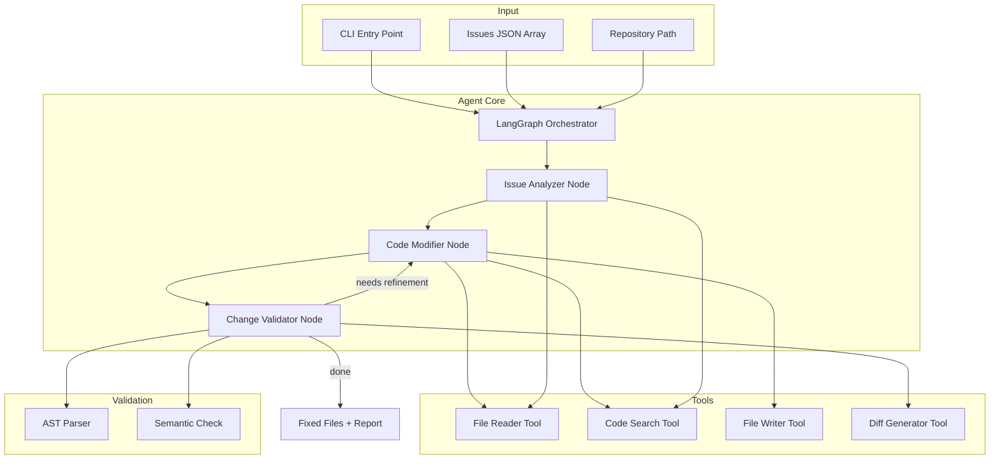

# SonarQube Issue Fixer Agent Architecture

A LangChain-based agent that receives SonarQube Cloud issues and attempts to automatically fix them within a target repository.

## User Review Required

> [!NOTE]
> **Configuration Decisions Made**:
> - **LLM Providers**: Both OpenAI and Anthropic for benchmarking
> - **Issue Scope**: BUG, VULNERABILITY, CODE_SMELL (excluding security hotspots)
> - **Validation**: AST-based validation using Python `ast` + `tree-sitter`

## Architecture Overview



---

## Component Descriptions

### Input Layer

| Component | Description |
|-----------|-------------|
| **CLI Entry Point** | Command-line interface (`cli.py`) that accepts repo path, issues JSON, LLM provider choice, and dry-run flag |
| **Issues JSON Array** | Response from SonarQube's `api/issues/search` - array of issue objects with rule, severity, file path, line number, and message |
| **Repository Path** | Local path to the Git repository where issues need to be fixed |

### Agent Core (LangGraph)

| Component | Description |
|-----------|-------------|
| **LangGraph Orchestrator** | Main workflow engine managing the fix pipeline via state machine pattern |
| **Issue Analyzer Node** | Reads file containing the issue, understands context, plans fix strategy using LLM |
| **Code Modifier Node** | Generates actual code fix using LLM based on analysis |
| **Change Validator Node** | Safety gate - validates proposed fix before committing, triggers retries if validation fails |

### Validation Layer

| Component | Description |
|-----------|-------------|
| **AST Parser** | Uses Python's `ast` module to verify modified code parses correctly and compare structure before/after |
| **Semantic Check** | Uses tree-sitter for multi-language syntax validation, finds `ERROR` nodes to detect malformed code |

### Tools (LangChain)

| Component | Description |
|-----------|-------------|
| **File Reader Tool** | Reads full file content from repository |
| **AST Locator Tool** | **Uses tree-sitter AST** to find exact node at issue line/column, returns node + parent context |
| **Code Search Tool** | Searches repo for patterns to find related usages, similar code, or dependencies |
| **File Writer Tool** | Writes modified content back to files (respects dry-run mode) |
| **Diff Generator Tool** | Creates unified diffs showing proposed changes for review |

---

## Proposed Changes

### Core Package Structure

```
debt_zero_agent/
├── __init__.py
├── __main__.py
├── cli.py                      # [MODIFY] Enhanced CLI with args
├── agent/
│   ├── __init__.py
│   ├── graph.py               # [NEW] LangGraph workflow definition
│   ├── nodes.py               # [NEW] Agent nodes (analyze, fix, validate)
│   ├── state.py               # [NEW] Agent state model
│   └── llm.py                 # [NEW] LLM factory (OpenAI/Anthropic)
├── models/
│   ├── __init__.py
│   ├── issue.py               # [NEW] SonarQube issue Pydantic models
│   └── fix.py                 # [NEW] Fix result models
├── validation/
│   ├── __init__.py
│   ├── ast_validator.py       # [NEW] Python AST syntax validation
│   ├── tree_sitter.py         # [NEW] Multi-lang syntax via tree-sitter
│   └── locator.py             # [NEW] AST-based issue localization
├── tools/
│   ├── __init__.py
│   ├── file_reader.py         # [NEW] Read files from repo
│   ├── code_search.py         # [NEW] Search code with context
│   ├── file_writer.py         # [NEW] Write modified files
│   └── diff_tool.py           # [NEW] Generate diffs for review
└── prompts/
    ├── __init__.py
    └── templates.py           # [NEW] System/user prompt templates
```

---

### Models Module

#### [NEW] [issue.py](file:///Users/jacekporeda/src/debt-zero-agent/debt_zero_agent/models/issue.py)

Pydantic models for parsing SonarQube API response:

```python
class TextRange(BaseModel):
    startLine: int
    endLine: int
    startOffset: int | None = None
    endOffset: int | None = None

class SonarQubeIssue(BaseModel):
    key: str
    rule: str                    # e.g., "python:S1234"
    severity: str                # BLOCKER, CRITICAL, MAJOR, MINOR, INFO
    component: str               # File path in SonarQube format
    message: str                 # Issue description
    line: int | None = None
    textRange: TextRange | None = None
    type: str                    # BUG, VULNERABILITY, CODE_SMELL
    tags: list[str] = []
    
class IssueSearchResponse(BaseModel):
    issues: list[SonarQubeIssue]
    total: int
    p: int = 1                   # page
    ps: int = 100                # page size
```

---

### Agent Module (LangGraph)

#### [NEW] [state.py](file:///Users/jacekporeda/src/debt-zero-agent/debt_zero_agent/agent/state.py)

TypedDict for agent state:

```python
class AgentState(TypedDict):
    repo_path: str
    current_issue: SonarQubeIssue | None
    pending_issues: list[SonarQubeIssue]
    completed_issues: list[FixResult]
    failed_issues: list[FailedFix]
    current_file_content: str | None
    proposed_fix: str | None
    iteration_count: int
```

#### [NEW] [nodes.py](file:///Users/jacekporeda/src/debt-zero-agent/debt_zero_agent/agent/nodes.py)

Agent node functions:

| Node | Purpose |
|------|---------|
| `select_next_issue` | Pick next issue from queue, update state |
| `analyze_issue` | Read file, understand issue context, plan fix |
| `apply_fix` | Generate and apply code modification |
| `validate_fix` | **AST validation** + semantic checks, decide retry/continue |
| `finalize` | Collect results, generate report |

---

### Validation Module

#### [NEW] [ast_validator.py](file:///Users/jacekporeda/src/debt-zero-agent/debt_zero_agent/validation/ast_validator.py)

```python
import ast
from dataclasses import dataclass

@dataclass
class ValidationResult:
    valid: bool
    errors: list[str]
    warnings: list[str]

def validate_python_syntax(code: str) -> ValidationResult:
    """Parse code with ast module, return syntax errors if any."""
    try:
        tree = ast.parse(code)
        return ValidationResult(valid=True, errors=[], warnings=[])
    except SyntaxError as e:
        return ValidationResult(valid=False, errors=[str(e)], warnings=[])

def compare_ast_structure(original: str, modified: str) -> ValidationResult:
    """Ensure modification doesn't break unrelated code structures."""
```

#### [NEW] [tree_sitter.py](file:///Users/jacekporeda/src/debt-zero-agent/debt_zero_agent/validation/tree_sitter.py)

```python
from tree_sitter_languages import get_parser

def validate_syntax(code: str, language: str) -> ValidationResult:
    """Multi-language syntax validation using tree-sitter."""
    parser = get_parser(language)
    tree = parser.parse(code.encode())
    
    errors = []
    def find_errors(node):
        if node.type == "ERROR":
            errors.append(f"Syntax error at line {node.start_point[0]+1}")
        for child in node.children:
            find_errors(child)
    
    find_errors(tree.root_node)
    return ValidationResult(valid=len(errors)==0, errors=errors, warnings=[])
```

#### [NEW] [locator.py](file:///Users/jacekporeda/src/debt-zero-agent/debt_zero_agent/validation/locator.py)

AST-based issue localization - finds exact code node at issue position:

```python
from dataclasses import dataclass
from tree_sitter_languages import get_parser

@dataclass
class IssueContext:
    """Rich context around the issue location."""
    node_type: str           # e.g., "function_definition", "call", "identifier"
    node_text: str           # The exact code at this node
    parent_type: str         # Parent node type for context
    parent_text: str         # Parent node code
    siblings: list[str]      # Adjacent statements for broader context
    start_line: int
    end_line: int

def locate_issue(code: str, language: str, line: int, column: int = 0) -> IssueContext:
    """
    Find the AST node at the given line/column position.
    Returns node + parent context for precise targeting.
    """
    parser = get_parser(language)
    tree = parser.parse(code.encode())
    
    def find_deepest_node(node, target_line, target_col):
        """Recursively find the most specific node containing the position."""
        for child in node.children:
            if (child.start_point[0] <= target_line <= child.end_point[0]):
                return find_deepest_node(child, target_line, target_col)
        return node
    
    node = find_deepest_node(tree.root_node, line - 1, column)
    parent = node.parent if node.parent else node
    
    return IssueContext(
        node_type=node.type,
        node_text=node.text.decode(),
        parent_type=parent.type,
        parent_text=parent.text.decode(),
        siblings=[s.text.decode() for s in parent.children[:3]],
        start_line=node.start_point[0] + 1,
        end_line=node.end_point[0] + 1,
    )
```

---

### LLM Factory Module

#### [NEW] [llm.py](file:///Users/jacekporeda/src/debt-zero-agent/debt_zero_agent/agent/llm.py)

```python
from enum import Enum
from langchain_openai import ChatOpenAI
from langchain_anthropic import ChatAnthropic

class LLMProvider(str, Enum):
    OPENAI = "openai"
    ANTHROPIC = "anthropic"

def get_llm(provider: LLMProvider, model: str | None = None):
    """Factory for LLM instances to enable benchmarking."""
    if provider == LLMProvider.OPENAI:
        return ChatOpenAI(model=model or "gpt-4o")
    elif provider == LLMProvider.ANTHROPIC:
        return ChatAnthropic(model=model or "claude-sonnet-4-20250514")
```

#### [NEW] [graph.py](file:///Users/jacekporeda/src/debt-zero-agent/debt_zero_agent/agent/graph.py)

LangGraph workflow with conditional edges:

```python
workflow = StateGraph(AgentState)
workflow.add_node("select", select_next_issue)
workflow.add_node("analyze", analyze_issue)
workflow.add_node("fix", apply_fix)
workflow.add_node("validate", validate_fix)
workflow.add_node("finalize", finalize)

workflow.add_edge(START, "select")
workflow.add_edge("select", "analyze")
workflow.add_edge("analyze", "fix")
workflow.add_edge("fix", "validate")
workflow.add_conditional_edges(
    "validate",
    should_continue,  # retry fix, next issue, or end
    {"retry": "fix", "next": "select", "end": "finalize"}
)
```

---

### Tools Module

#### [NEW] [file_reader.py](file:///Users/jacekporeda/src/debt-zero-agent/debt_zero_agent/tools/file_reader.py)

```python
@tool
def read_file(repo_path: str, file_path: str, 
              start_line: int | None = None, 
              end_line: int | None = None) -> str:
    """Read file content, optionally within a line range."""
```

#### [NEW] [code_search.py](file:///Users/jacekporeda/src/debt-zero-agent/debt_zero_agent/tools/code_search.py)

```python
@tool
def search_code(repo_path: str, query: str, 
                file_patterns: list[str] | None = None) -> list[SearchResult]:
    """Search for code patterns in the repository."""
```

#### [NEW] [file_writer.py](file:///Users/jacekporeda/src/debt-zero-agent/debt_zero_agent/tools/file_writer.py)

```python
@tool
def write_file(repo_path: str, file_path: str, 
               content: str) -> WriteResult:
    """Write modified content to a file."""
```

---

### CLI Enhancement

#### [MODIFY] [cli.py](file:///Users/jacekporeda/src/debt-zero-agent/debt_zero_agent/cli.py)

```python
import argparse
import json

def main() -> None:
    parser = argparse.ArgumentParser(
        description="Fix SonarQube issues automatically"
    )
    parser.add_argument(
        "repo_path", 
        help="Path to the repository directory"
    )
    parser.add_argument(
        "--issues", "-i",
        required=True,
        help="Path to JSON file with issues array (from api/issues/search)"
    )
    parser.add_argument(
        "--dry-run",
        action="store_true",
        help="Show proposed fixes without applying them"
    )
    args = parser.parse_args()
    
    # Load issues and run agent
    with open(args.issues) as f:
        issues_data = json.load(f)
    
    from debt_zero_agent.agent.graph import run_agent
    run_agent(args.repo_path, issues_data["issues"], dry_run=args.dry_run)
```

---

### Dependencies

#### [MODIFY] [pyproject.toml](file:///Users/jacekporeda/src/debt-zero-agent/pyproject.toml)

```diff
 dependencies = [
+    "langchain>=0.3.0",
+    "langchain-openai>=0.3.0",
+    "langchain-anthropic>=0.3.0",
+    "langgraph>=0.2.0",
+    "pydantic>=2.0.0",
+    "tree-sitter-languages>=1.10.0",  # Multi-lang AST parsing
 ]
```

---

## Verification Plan

### Automated Tests

**Unit tests** for models and tools:

```bash
# After creating tests/test_models.py
poetry run pytest tests/test_models.py -v
```

**Integration test** with sample issues JSON:

```bash
# Create tests/fixtures/sample_issues.json with mock data
# Run against a test repository
poetry run debt-zero-agent ./tests/fixtures/sample_repo --issues ./tests/fixtures/sample_issues.json --dry-run
```

### Manual Verification

1. **Setup**: Configure LLM API key in environment
2. **Run dry-run mode** with real SonarQube issues from your project
3. **Review proposed diffs** before allowing actual writes
4. **Verify fixes** by re-running SonarQube analysis on modified files
